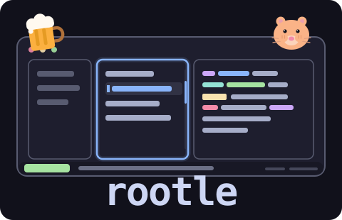

# rootledev/homebrew-tap

[](https://github.com/rootledev/homebrew-tap/actions/workflows/test.yml)
[](https://github.com/rootledev/homebrew-tap)



Homebrew tap for [rootle](https://rootle.dev/) — a modal TUI for
browsing remote source-control systems from the terminal.

```
brew install rootledev/tap/rootle
```

The formula builds from the crates.io source crate, so macOS
(arm64 + x86_64) and Linux both work. Version + checksum bumps are
automated by rootle's release workflow.

Trust notes: CI runs `brew style`, `brew audit --new`, a full
build-from-source install, and `brew test` on every change (and weekly)
on both macOS and Linux — see the badge above. There is no official
"verified tap" program; a green, public CI run against every commit is
the strongest signal a tap can offer.
